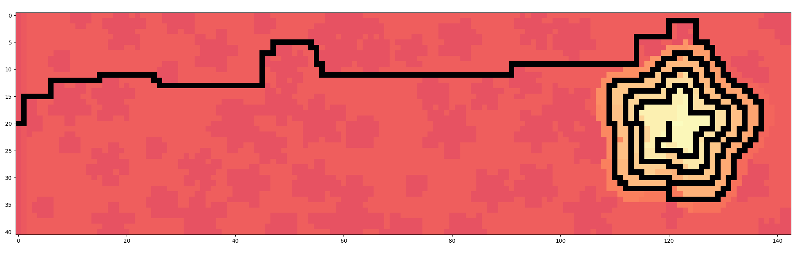

### Day 08

Part1: I realized halfway through the first part that I'd better use numpy as slicing rows and columns is faster and less error-prone. My venv did not contain pip so I couldn't install numpy and wasted 10mn trying to fix the issue before I gave up, knowing that without numpy there'll be more debugging to be done

Part2: As expected more debugging was needed for part 2. I had the correct logic but the results weren't correct. It was sadly due to a nasty off by one error that costed me at least 20m

### Day 09

This is one of those puzzles that seem complex at first glance, you then spend precious time trying to figure out how to approach the monster, only to find out later that the solution is rather simple.

The problem at hand tries to simulate movements of a rope as it moves. It starts up with a simple case of a rope of only two points, head and tail, then generalizes it for a rope of N points. In other words, it's a snake game where there are no obstacles, ie the snale has an infinite world and it can go through itself without dying. How cool is that!

Part1: As the problem seemed complex at first, I was thinking about how to represent an infinite world where the snake would move. I had no idea about how to approach that so I did a first simulation to estimate my input's range so I can build a world that can fit thos limits. But by doing that, I realized that it's not needed, I only had to keep track of coordinates of two points moving them according to the input. Took me about half an hour to figure that out.

Part2: It was a piece of cake. It's a generalization of part 1 and was pretty straight forward. However I wasted time with a stupid bug where I was updating the result inside of a loop instead of outside it because I forget to move the instruction outside of it. Reading the requirements again helped me realize the issue. After I moved the problematic line of code to the right place, the result was correct


I solved the two parts in 1h:45mn, remove a 45mn of stupid bugs and fighting with the language and libraries, and it'll be a 1h of pure problem solving. The top competitive programmers did it in less than 8 minutes. Which I find reasonable because with enough experience one should figure out rapidly it's about implementing a simple snake game.

Today's problem is my favorite so far. Although I misjudge it at first as being a complex problem, which is clearly a lack of experience on my part, I find the solution surprizingly simple and the visualizations for debugging pretty cool. Fun times.

### Day 10

Another cool puzzle! This time it's about decoding input instructions and rendering them in a CRT screen.

Part1: The puzzle seemed intimidating at first, but I quickly got the hang of it and started writing code. As I was writing I was more and more confident that my code would work, but in fact it didn't. Again I didn't read the requirements carefully and I started executing instructions as long as I read them, whereas I should have only started executing an instruction when the last one finies, ie, there's only a single CPU core to work with. This mainly where my time was spent, debugging my code to understand why it doesn't pass the test, and the fixing it. Also, the order of phases is really important and I messed that up at first.

Part2: It was completely unexpected and it was as cool as intimidating. Drawing on a horizontal scanning CRT screen using the value of CPU register that is supposed to represent a 3 pixels sprite? I was like, here we go again for another 90mn of coding. Fortunately, it only a matter of adding an extra step to the previous phases at the right place (that's what Eric meant by 'carefully synchronizing CPU and CRT drawing'). I did that without issues and was happy my implementation in step1 wasn't slowing me down.

Here's the produced result from my input:

```
###..###..####..##..###...##..####..##..
#..#.#..#....#.#..#.#..#.#..#....#.#..#.
#..#.###....#..#....#..#.#..#...#..#..#.
###..#..#..#...#.##.###..####..#...####.
#....#..#.#....#..#.#.#..#..#.#....#..#.
#....###..####..###.#..#.#..#.####.#..#.
```

I don't know what that means, but getting it to display correctly on "first" try was awesome.

### Day 11

So we find ourself surrounded by monkeys that stole some personal items and are now passing them around to each other. Monkeys are able to sense our worry about items and use it to decide to which monkey to pass items.

Part1: The input seemed a pain to parse at first, luckily it wasn't a small input that can be hardcoded into the solution, so no need to write a parser today. In the first 30 minutes I have read the puzzle and have my input ready to be processed. The next 1h20mn are spent debugging stupid bugs and realizing I haven't read the instructions carefully (I overlooked the worry level that should be divided by 3)

Part2: Our here can no longer manage its worry level (by divising it by 3). It'll now skyrocket to crazy unmanageable levels. Not only that but we need to run the simulation for 10k times as opposed to 20 in the first part. It is clearly an optimization problem! So I remove the worry management code, and I run my code for 1k rounds, the fans on my laptop started kicking-in and the execution took forever. Brute force is not an option, as always with AoC puzzles. I spent some time thinking about optimizing code, finding memory or bottlnecks. Eventually I realized the continuous squaring of values that some monkeys do is the true bottlneck. Took me about 30mn to find a strategy to use and another 30mn to implement it correctly.


I hated monkeys before, now I hate them even more!

### Day 12

I failed miserably at it. I'm still not good with path finding algorithms. I came back to it later on the day and implemented A*, then Dijkstra. Both worked on example but not on actual input. Will have to come back to it later.

EDIT: Ok I have now solved both parts, almost two days later.

Part1: It is clear as sky that it's about a path finding algorithm. I'm not familiar enough with these types of algorythms but I know pretty well the theory and I needed some time to refresh my memory on how to implement some of them. Obviously I couldn't solve part1 in the morning so I gave it another try the evening. After a good refresher on Youtube I implemented A*, I run my code on example input and it worked. On real input the result was wrong! I doubled checked my A* algorithm and everything was correct. I was out of ideas and I decided to leave it for another day. Next day evening I gave it another try, this time I tried vizualizing my input and the path found by my A* to see what's actually happening with my code. And surprize surprize, I saw something strange! The vizualization I've done is colormapped, the color transition nicely for the whole map except for one single point. Turned out that one single point is supposed to be the starting poit for my A* algorithm, and I made the stupid mistake of starting from point (0,0) because that's what the starting point on the example. I faceplamed really hard, but at the same time I was relieved that there was nothing wrong with my code, only with the input parameters. Once I set the correct starting point, I got the correct answer (which, interestingly, was one unit of lenght more than my previous wrong answer with the wrong starting point. I could have just called it a off-by-one error and resubmit my wrong answer +1 or -1)

Part2: I brute forced my way into it. I run A* for all possible starting points, it took few seconds before computing the optimal result but it was correct on first try. Now that I think about it, it might have been easier to just run A* by starting from the end and stpooing at the first eligible point. I still kept my brute force version.

I is inevitable to waste time on stupid errors that come only from misreading the instructions. I should be more careful to read everything properly and not miss anything of importance. I also got a good refresher on path finding algorithms so I'll be more prepared and confident for later puzzles that might require them.

Here's a viz of my found path to get from Start to End of map.



Too bad Day 12 broke my streak of solving day puzzles before starting my day.

### Day 13

Part1: I cheated my way out of parsing by using eval. I think that's find because AoC is not about parsing but actually solving the problem. So thanks Python! Implementing the sorting wasn't a big challenge just some type errors and inputs that were not in the right order. Other than that it was straight forward.

Part2: Was a breeze. Adapted the already implemented comparing function to return [-1,0,1] instead of [True,False,None] so it can work with sort function of Python. Worked on first try. It's a reliefe from past day problems which consistently gave me a hard time solving them.

I learned about the use of Python's `eval` and the safer version `literal_eval`. Input could also have been parsed using any json parser since every line is a valid json array. So far I really like Python, I never felt it was in the way of me solving puzzles, even though I am not as proficient in it as in C#, which btw I'll never use for solving puzzles as it is verbose and not as elegant as Python.

### Day 14

We're inside a cave and sand starts to fall down from the roof. We need to quickly simulate the final state of the cave after all sand have fallen to avoid getting trapped.

Part1: Input was a bit of a pain to parse and it took longer than solving the actual problem. I decided to build a set of all obstacles in the map so my simulation can be easy to run. It was a good decision and I got exactly what I expected. To be fair the rules of sand falling are pretty simple. After some few tweaks, bug hunting and avoidance of infinite loops, I got the correct result.

Part2: The model I built in Part1 was good enough for solving part2 without any issues. I tweaked the map as suggested in puzzle description and run the simulation again. In fact, I remember me incorectly impelenting in Part1 exactly what was asked in Part2, so when I read Part2 I realized that and I just has to rewrite code I've already written before. Took me 6mn to get the correct result with no major issues.

Although the solution was correct, it'd be a shame to stop at abstract code and not do some viz for such a visual puzzle. So here's a viz of my input after filling it with sand. Beautiful!


### Day 15

Part1: Given a list of diamonds with varying shapes, the problem is to find the numner of interesection between all diamonds and a specific row. I brute forced my way into this without any shame. My solution takes a few seconds to compute so I'm sure there are smarter ways to find the answer but for now my code does the job.

Part2: I tried bruteforcing but tqdm reported it'll take ages. I gave up after a few mintes and thought about the problem on my way to work. I realized the point we're looking for must be at the edge of a diamond, so that reduces the number of points I needed to test to find the answer. Once I was back home I implemented my idea and it worked, although answer needed about 3mn to compute but that was reasonable and I was happy to get my 2 starts for the day. I checked other peopl's answers on reddit and OMG solutions were all over the place. Some using pure mathematics to compute the answer, some have brute forced it, some have used online tools to plot the shapes and manually find the answer. It was cool seeing how creative people were at this puzzle.

### Day 16

Another path finding puzzle that requires being familiar with graph theory! I couldn't do a thing first time and I decided to do it later. Next day I gave it a real try and was able to write a decent strategy that works with the example but performance is so poor there's no change it can run on actual input. I implemented a simple graph traversal algorithm with a few optimizations here and there but that's not enough. I'll have to get back to this later as I don't have the sligntest idea on how I can write some decent solver. 

### Day 17

Basically a Tetris game simulator where the input is the actual player's input and the answer requires running a simulation of it.

Part1: Game rules seem to be simple enough but there's a lot of things going on so there will be bugs everywhere and the competitive advantage is doing as few bugs as possible to move fast. I had my big share of bugs for this one, took me few hours of debugging to get it right. Numpy sure did help and my strategy was also simple and a good fit for the problem.

Part2: The answer requires simulating 10^12 moves of the game. There's no way you can brute force your way around this. If by miracle you can simulate 10^6 moves each second, the full simulation would still need 11 days of runtime to finish. So when I saw that big number I knew I needed to change strategy. After few minutes I wondered if there were some pattern in the tetris that I can exploit, and sure they were. Finding the pattern was quick, but using it to find the answer took me a while, but I eventually found the correct answer and took the care to document my code and make it work with any input (provided all user inputs are periodic).

It was a fun puzzle. Not a difficult one but an interesting and a gratifying one nonetheless.